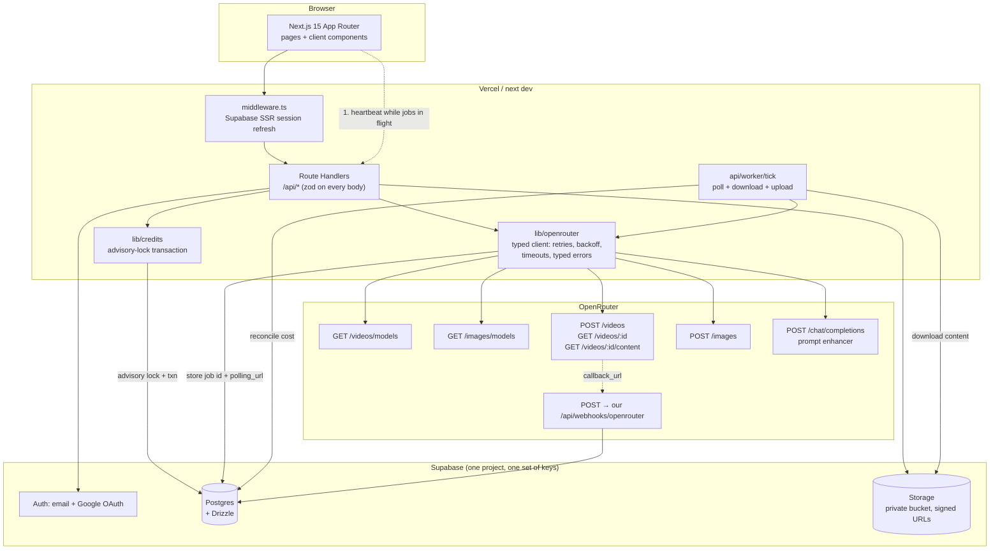
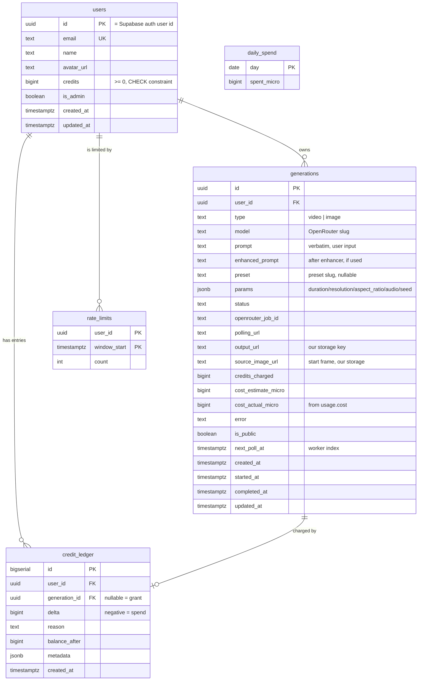

# PLAN.md — Vantage

An AI image/video generation web app. Original name and design; the inspiration
was the general UX shape of cinematic camera-motion presets, image-to-video, and
prompt enhancement. No branding, copy, or assets were taken from anywhere.

**Working name: `Vantage`** — a single constant in `src/lib/config.ts`, change it
in one place if you want something else.

---

## 0. Read this first: what I verified, and what I could not

The brief said "verify against live docs; do not guess", so here is exactly what
I ran and what I merely read.

### Verified live today, with no API key

Both discovery endpoints return **HTTP 200 without any authentication**. This is
the single most useful thing I found, because it means the model dropdown,
capability gating, and most of the cost engine can be built and tested before
you add a key.

| Call | Result |
|---|---|
| `GET /api/v1/videos/models` | 200, 28,147 bytes, **30 video models** |
| `GET /api/v1/images/models` | 200, 42,683 bytes, **55 image models** |
| `GET /api/v1/images/models/{id}/endpoints` | 200, per-provider pricing |

### The documentation is wrong about pricing, and I only know because I called it

The published video-generation doc shows this shape:

```json
"pricing_skus": { "per-video-second": "0.50", "per-video-second-1080p": "0.75" }
```

**The live API does not return that.** It returns, for `alibaba/wan-3.0`:

```json
"pricing_skus": {
  "duration_seconds_480p": "0.05",
  "duration_seconds_720p": "0.1",
  "duration_seconds_1080p": "0.2"
}
```

If I had coded against the docs, the cost estimator would have silently returned
`null` for every model and every quote would have read "unavailable". I am coding
against the **live** shape and pinning a captured fixture in a unit test so a
future API change fails loudly rather than quietly zeroing all prices.

### I could not verify anything that costs money

`POST /api/v1/videos`, polling, content download, webhook signature verification,
the chat-completions prompt enhancer, and whether my cost estimate matches the
billed `usage.cost` **all require `OPENROUTER_API_KEY`**, which I do not have.
Separately, my own agent account is out of funds, so I cannot run a nested
`opencode run` to prove them either.

This means the brief's process step 3 — "a CLI script that generates one real
video, to prove the integration before building UI" — is something I can *build*
but **cannot run**. I will write `scripts/prove-integration.mjs`, and you run it
with your key. I will report its output honestly rather than assuming it passes.

Everything in this plan that I have not executed is labelled **[UNVERIFIED]**.

---

## 1. Architecture



### Stack, and why

| Choice | Decision | Reason |
|---|---|---|
| Framework | Next.js 15 App Router + TS strict | as briefed |
| UI | Tailwind + shadcn/ui | as briefed |
| Database | **Supabase Postgres**, Drizzle over `postgres-js` | see below |
| Auth | **Supabase Auth** (email + Google) | see below |
| Storage | **Supabase Storage**, private bucket + signed URLs | see below |
| Worker | `api/worker/tick`, three interchangeable drivers | see §5 |

**Why Supabase rather than local Docker Postgres.** The brief's definition of
done is "I can run the app … with `npm run dev` after I add my keys". Supabase
makes that one account and one `.env`, with no daemon, no port collision, and no
schema bootstrap step. It also removes the two places this project would
otherwise need custom code that does not exist yet: password hashing and session
management (Supabase Auth), and public/signed URL issuance (Supabase Storage).

The cost is a documented dependency on their Postgres connection shape. **The
Drizzle schema stays portable** — no PostGIS, no Supabase-only column types, no
RLS policies baked into the tables — so pointing it at a local `docker-compose`
Postgres is a `.env` change plus `drizzle-kit push`. I am choosing the option the
brief explicitly permits and documenting the alternative rather than pretending
this is the only way.

**One gotcha I will handle for you:** Supabase's *direct* connection string is
IPv6-only and will not connect from most dev machines. The app must use the
**Supavisor pooler** string. `postgres-js` works over it. This is in `.env.example`
with the URL shape spelled out, because it is a guaranteed first-run failure
otherwise.

**Why `postgres-js` and not Drizzle's `supabase-js` driver.** Atomic credit
deduction needs real multi-statement transactions and `pg_advisory_xact_lock`.
The Supabase JS driver goes through PostgREST and cannot do either.

---

## 2. Data model (Drizzle)



Notes on the two decisions worth arguing about:

- **Money is stored as integer micro-units** (`cost_estimate_micro`, `1e-6` USD),
  never as a float. Float dollars accumulate rounding error that shows up as
  ledger rows that do not sum to the balance.
- **`credit_ledger` is append-only, enforced by the database**, not by
  convention. A `BEFORE UPDATE OR DELETE` trigger that raises an exception. A
  ledger that can be rewritten is not an audit trail, and an audit trail is the
  only reason to keep one.

Camera presets ship as **JSON in the repo** (`src/lib/presets.json`), not a
table — the brief allows either, and a file makes "add a preset" a one-object
diff. §8 has the recipe.

---

## 3. The cost engine — the genuinely hard part

This is where the design has real risk, so it gets its own section.

`pricing_skus` is undocumented and **not normalised**. Across the 30 live video
models I counted **17 distinct key shapes**, in five different unit conventions:

| Convention | Example keys | Models |
|---|---|---|
| USD per second | `duration_seconds`, `duration_seconds_480p`, `duration_seconds_768p`, `duration_seconds_720p`, `duration_seconds_1080p`, `reference_duration_seconds_480p` | 22 |
| USD per second, mode-prefixed | `text_to_video_duration_seconds_720p`, `image_to_video_duration_seconds_1080p` | 12 |
| **cents** per second | `cents_per_second_output`, `cents_per_second_output_720p`, `cents_per_video_output_second_480p` | 11 |
| **per token** | `video_tokens`, `video_tokens_without_audio`, `video_tokens_4k`, `video_tokens_with_video_input` | 6 |
| cents per **megapixel**-second | `cents_per_megapixel_second_precise` | 2 |
| flat / auxiliary | `reference_images`, `minimum_cents_per_generation`, `cents_per_image_input` | 5 |

A naive `Number(skus["duration_seconds_" + resolution]) * duration` gets the
answer right for maybe half the catalogue and wrong in ways that are hard to
notice, because the wrong ones return a plausible number.

### Design

1. **Normalise on ingest.** `GET /api/models` parses every SKU key into a typed
   `PriceRule[]` via a small grammar, and the client dropdown consumes only the
   normalised shape. Raw keys never reach pricing code.
2. **Resolve most-specific-first** at quote time, walking a fixed chain:
   `image_to_video_duration_seconds_{res}` → `text_to_video_duration_seconds_{res}`
   → `duration_seconds_{res}` → `duration_seconds_with_audio_{res}` →
   `duration_seconds_without_audio_{res}` → `duration_seconds_with_audio` →
   `duration_seconds_without_audio` → `duration_seconds` → `cents_per_*` (÷100).
3. **Add the auxiliaries:** `reference_images` × ref count,
   `cents_per_image_input` × input-image count (÷100).
4. **Apply the floor:** `minimum_cents_per_generation` (÷100).
5. **Multiply by duration in seconds.**

### The part that cannot be computed, handled honestly

Five models — every Seedance variant, and FLUX upscale — are priced **per video
token** or **per megapixel-second**. OpenRouter does not publish a token↔duration
mapping, so a true pre-submit cost is not derivable from the fields a client has.

I will not paper over this with a guess that looks like a price. Instead the quote
returns a discriminated result:

```ts
type Quote =
  | { estimable: true;  costUsd: number; credits: number; basis: string }
  | { estimable: false; credits: number; basis: string;
      reason: "per-token pricing with no public token mapping" }
```

For `estimable: false` the UI shows **"estimate unavailable — metered per token"**
and the server reserves a **configurable ceiling** (`PER_TOKEN_RESERVE_USD`) so
the user still cannot overspend. On completion the reservation is reconciled
against the real `usage.cost` and the difference is refunded or topped up through
the ledger. The user is quoted honestly and charged accurately.

### Reconciliation, which is the real answer to "refund on failure"

- **failed / expired** → refund the full reservation.
- **completed** → charge `usage.cost`, refund `estimate − actual` if the estimate
  was high. Since I compute in micro-units this is exact, and the refund is a
  ledger row, not an edit to the original charge.
- **cancelled** → depends on open question Q3 below. If OpenRouter has no cancel
  endpoint, it will keep rendering and still bill, and refunding anyway means the
  operator eats it. That is a product decision I need from you, not a default I
  should silently pick.

---

## 4. Generation lifecycle

```
queued ──▶ submitting ──▶ generating ──▶ downloading ──▶ completed
   │            │             │              │
   └────────────┴─────────────┴──────────────┴──▶ failed
                                                  cancelled
```

| State | Who moves it | Notes |
|---|---|---|
| `queued` | DB insert | credits already reserved |
| `submitting` | worker | POST `/videos`; stores `job_id` + `polling_url` |
| `generating` | worker | poll on `next_poll_at` backoff |
| `downloading` | worker | GET `/content?index=0` with the key, re-upload to our bucket |
| `completed` | worker | signed URL issued on read, not stored |
| `failed` / `cancelled` | worker or user | refund via ledger |

**Backoff:** 5s, 10s, 20s, 40s, 60s, then 60s flat, with a `JOB_MAX_AGE` ceiling
after which the job is marked `expired` and refunded. Written to
`generations.next_poll_at` and indexed, so a tick touches only rows that are due.

**Reconciliation is idempotent.** Every worker step is a single transaction that
re-reads the row and bails if it already moved past the step. A double tick, a
retried webhook, and a crashed worker all converge to the same state. This is the
property that lets me offer three different worker drivers without any of them
being able to corrupt anything.

---

## 5. The worker: one route, three drivers

The brief rules out long-lived serverless requests, so there is no in-request
polling loop. Instead there is one idempotent route, `POST /api/worker/tick`,
authenticated by `WORKER_SECRET` (not user auth), which claims up to `N` due jobs
using `SELECT … FOR UPDATE SKIP LOCKED` and advances each one.

It is driven by whichever of these is available:

| Driver | When | Honest note |
|---|---|---|
| `npm run worker` | local dev | a plain node loop, every 5s. **This is the default.** |
| Client heartbeat | any deployment | the generate page pings the tick route every 4s while it has in-flight jobs. Works with no scheduler at all. |
| Vercel Cron | production | **only on Pro.** Hobby cron granularity is once per *day*, which is useless here. Documented as a limitation. |

The client heartbeat is what makes this actually deployable on a free tier, and
it costs one tiny request every few seconds only while a job is running.

**Webhooks are implemented but not the primary mechanism.** `callback_url` is set
on submit, and `/api/webhooks/openrouter` verifies
`X-OpenRouter-Signature` as HMAC-SHA256 over `"{t},{rawBody}"` with a 300s replay
window and `timingSafeEqual`. Polling is primary because it survives a worker that
is not running yet; the webhook only makes completion faster.

---

## 6. API surface

Every route: zod-validated body/query, session-checked, typed response.

| Method | Path | Purpose |
|---|---|---|
| `GET` | `/api/me` | profile + credit balance |
| `GET` | `/api/models` | **normalised** video models, in-memory cached 10 min |
| `GET` | `/api/models/image` | image models + per-endpoint pricing, cached 1 h |
| `GET` | `/api/presets` | camera presets from JSON |
| `POST` | `/api/enhance` | prompt enhancer → enhanced prompt |
| `POST` | `/api/quote` | cost + credit estimate for a config |
| `POST` | `/api/uploads` | start-frame upload, type/size/magic-byte validated |
| `POST` | `/api/generations` | reserve credits + enqueue |
| `GET` | `/api/generations` | own list, cursor-paginated |
| `GET` | `/api/generations/[id]` | one, with fresh signed URL |
| `PATCH` | `/api/generations/[id]` | public/private toggle, rename |
| `DELETE` | `/api/generations/[id]` | delete + storage object |
| `POST` | `/api/generations/[id]/cancel` | local cancel + refund (see Q3) |
| `POST` | `/api/generations/[id]/retry` | new job reusing prompt + params |
| `GET` | `/api/explore` | public generations, cursor-paginated |
| `GET` | `/api/admin/credits` | list users + balances |
| `POST` | `/api/admin/credits` | adjust, writes a ledger row |
| `POST` | `/api/worker/tick` | advance due jobs |
| `POST` | `/api/webhooks/openrouter` | webhook receiver, HMAC verified |

### Pages

`/` landing · `/login` · `/signup` · `/generate` (protected) · `/gallery`
(protected) · `/explore` (public) · `/g/[id]` public generation · `/admin`

### Key isolation properties

- Every query is scoped `WHERE user_id = session.user.id`. No route accepts a
  user id from the client.
- `is_public` is the **only** thing that makes a generation readable by anyone
  other than its owner, and it is checked in the query, not after the fetch.
- `OPENROUTER_API_KEY` is read only in server modules. There is no `NEXT_PUBLIC_`
  variable containing it, and I will add a build-time check that fails if it ever
  appears in a client bundle.

---

## 7. Abuse controls

| Control | Mechanism |
|---|---|
| Credit reservation | `pg_advisory_xact_lock(hashtext(user_id))` then conditional `UPDATE … WHERE credits >= $1`, inside one transaction, with a `CHECK (credits >= 0)` backstop |
| Max concurrent jobs | counted inside the same locked transaction, so it cannot race |
| Global daily cap | `daily_spend` row updated in the same transaction; reject when `spent + estimate > cap` |
| Rate limit | DB-backed fixed window per user, so it survives restarts and works across instances |
| Atomicity rationale | the advisory lock serialises **all** credit and concurrency operations per user. Two simultaneous submits cannot both read "1 job in flight" and both proceed |
| Input validation | zod on every route; uploads limited by declared size, sniffed magic bytes, and extension allowlist |
| Prompt moderation | pluggable `moderate()` interface. MVP is a local denylist + length/charset checks. **This is not real moderation** — documented as such. Where a model accepts a `contentModeration` passthrough param (`runway/gen-4.5`), that is passed through too |

Starting credits: `FREE_STARTING_CREDITS`, default `200` (= $2.00 of
OpenRouter spend, since 1 credit = $0.01).

---

## 8. Camera presets

`src/lib/presets.json`, validated by zod at import so a malformed entry fails at
boot rather than silently vanishing from the picker.

```jsonc
{
  "slug": "dolly-in",
  "name": "Dolly In",
  "category": "Push",
  "description": "Slow forward push, growing compression as the subject fills frame.",
  "promptFragment": "slow dolly push-in on the subject, deepening perspective compression",
  "negativeFragment": "static camera, zoom jump",
  "accent": "#7c5cff"   // thumbnail tint; no image assets needed
}
```

**Adding a preset = appending one object.** No code change, no migration. The
thumbnail is a CSS gradient from `accent`, which keeps the repo free of binary
assets. First batch: dolly in, dolly out, crash zoom, orbit, FPV drone, handheld,
tracking shot, rack focus, whip pan, crane up, bullet time.

**Adding a model = nothing.** Models are discovered at runtime. A new OpenRouter
model appears in the dropdown as soon as it exists upstream, and is filtered out
automatically if it lacks `supported_durations` / `supported_resolutions` /
`supported_aspect_ratios`, or if its price cannot be resolved. Four of the
30 current models (`flux-video-edit`, `heygen/avatar-iv`, `flux-video-upscale`,
`runway/aleph-2`) are editors/avatars/upscalers with no `supported_durations`
and are excluded from the generate dropdown for exactly that reason.

---

## 9. Prompt assembly

```
base prompt (user)
  → optional enhancer output          [LLM, short idea + preset → detailed prompt]
  → + preset.promptFragment           [camera motion]
  → + resolution/aspect/duration hint [from the selected model]
  → final prompt sent to OpenRouter
```

The enhancer is a plain chat completion through `/api/v1/chat/completions` on a
cheap configurable model. The user always sees both the original and the
enhanced prompt, and the original is what the log stores — an LLM rewrite is not
allowed to quietly become the record of what the user asked for.

---

## 10. Testing plan

| Target | What is actually asserted |
|---|---|
| Credit deduction | concurrent deducts cannot overdraw; `CHECK` fires; refund is exact in micro-units; ledger sums to balance |
| Prompt assembly | fragment injection, order, empty-fragment handling, prompt length cap |
| OpenRouter client | mocked `fetch`: 429 → retry with backoff, 402 → typed `InsufficientCreditsError` **no retry**, 5xx → retry then throw, timeout, `pricing_skus` normalisation incl. the live-vs-doc mismatch fixture |
| Cost resolver | the real 30-model payload, every one of the 5 unit conventions, the per-token `estimable:false` path, the `minimum_cents_per_generation` floor |
| Playwright | signup → generate → see result, **API fully mocked** |

The cost-resolver test runs against a **captured real payload** committed as a
fixture, so it is deterministic and does not hit the network.

---

## 11. Build order

Each step ends with typecheck + lint + test green, then a commit.

1. Scaffold, env validation (zod at boot), `.env.example`, Supabase client, Drizzle schema + migrations
2. Auth: email + Google, middleware session refresh, protected routes
3. `lib/openrouter` typed client + `scripts/prove-integration.mjs` — **the real-video proof. You run this; I cannot.**
4. Credits, ledger, rate limit, concurrency limit, daily cap
5. Model discovery + cost engine + quote endpoint
6. Generation lifecycle, worker, polling, storage
7. Prompt enhancer + image generation for start frames
8. UI: generate, gallery, explore, admin
9. Tests, README, cleanup

---

## 12. Open questions — I need answers to some of these

**Q1. Does `frame_images[].image_url.url` accept a base64 data URL?**
The doc shows only HTTPS URLs. If data URLs work, we skip signed-URL plumbing for
start frames entirely and generated start frames never touch public storage.
*Mitigation if no:* issue a 1-hour signed URL at submit time — the provider fetches
immediately, so this works regardless. **Low risk either way.**

**Q2. Is there a published token↔duration mapping for the Seedance models?**
If yes, the per-token models become exactly estimable. If no, they stay
`estimable: false` with a reservation ceiling. **I will search the cookbook; tell
me if you know.**

**Q3. Can an in-flight OpenRouter video job be cancelled?**
`cancelled` appears only as a *webhook event*; I found no cancel endpoint in the
docs. If there is none, cancelling locally means OpenRouter keeps rendering and
still bills us. **This decides the refund policy on cancel** — refund anyway and
eat it, or refund only on `failed`/`expired`. I need your call. I will not pick
this silently because it is a real money decision.

**Q4. Does the unsuffixed `duration_seconds` mean "default rate" or "any resolution"?**
`minimax/hailuo-3-max` has `duration_seconds: 0.08` *and* `duration_seconds_768p: 0.08`
— identical, suggesting a fallback rather than a separate tier. Confirmable only
with one real billed request. **My implementation treats it as a fallback.**

**Q5. Supabase or local Docker Postgres?**
I am proceeding with **Supabase** per §1, and will ship a documented
`docker-compose.yml` alternative. Say the word if you want Docker as the default
instead — the schema is designed to not care.

**Q6. Enhancer model choice.**
I will default to a cheap, fast chat model and make it one env var
(`ENHANCER_MODEL`). Tell me if you want a specific one.

---

## 13. Out of scope, listed as the brief requires

Custom character training (Soul ID style) · payments · video editing timeline ·
mobile apps. Also not attempted: real content moderation (the local check is a
guardrail, not a moderation service), and multi-region storage/CDN.