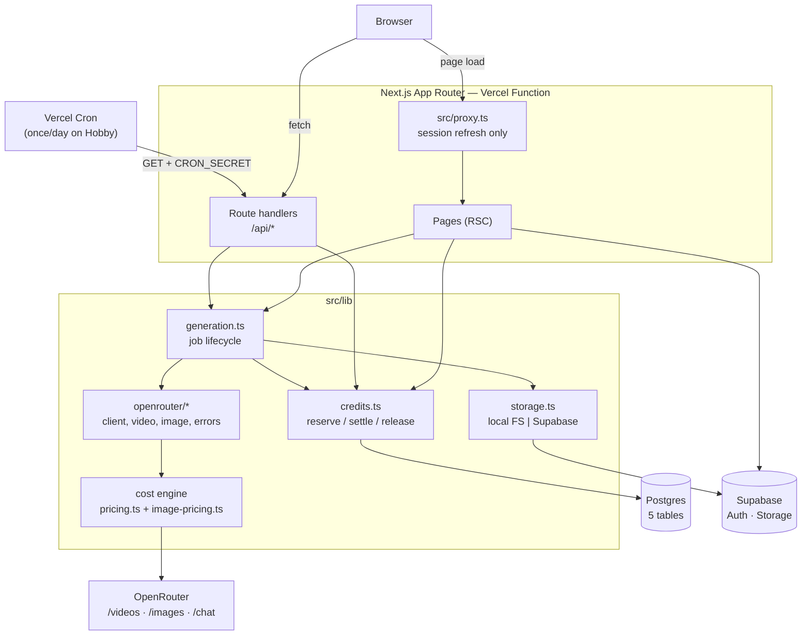
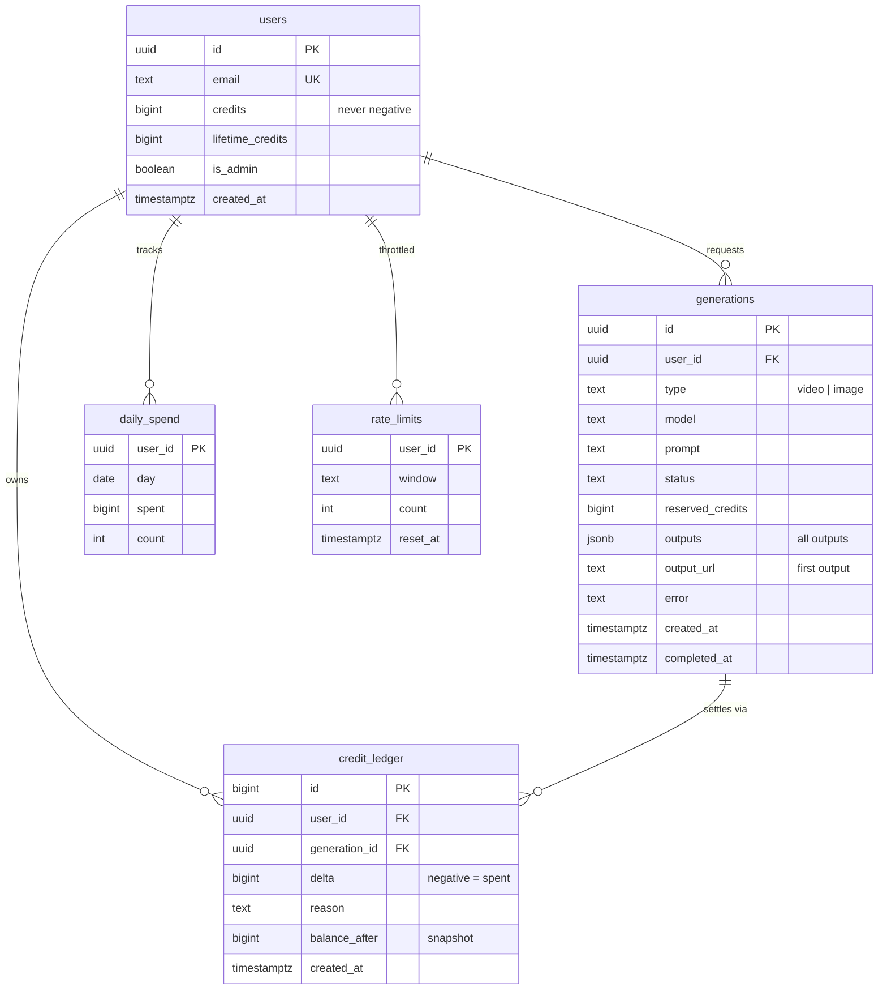

# Vantage

An AI image and video generation studio. Type a prompt, pick a model, watch a live
cost estimate, and get a finished asset in a gallery you own.

Built on OpenRouter's video, image and chat APIs. Deploys to Vercel's free tier.

```
npm install
cp .env.example .env.local     # optional -- the app boots with none of it
npm run dev                    # http://localhost:3000
```

It runs with **zero configuration**. With no environment at all it still serves
every page, still lists all 81 live models from OpenRouter, and `/setup` tells you
exactly which two values you need to generate. Nothing throws at import; missing
configuration is collected as readable strings and reported by `GET /api/setup`.

---

## Contents

- [What it does](#what-it-does)
- [Architecture](#architecture)
- [Data model](#data-model)
- [The cost engine](#the-cost-engine)
- [Deploying to Vercel](#deploying-to-vercel)
- [Environment variables](#environment-variables)
- [API surface](#api-surface)
- [Adding a model or preset](#adding-a-model-or-preset)
- [Tests](#tests)
- [What is verified, and how](#what-is-verified-and-how)
- [Limitations](#limitations)

---

## What it does

| Route | |
|---|---|
| `/` | Landing page. Public. |
| `/generate` | The studio. Prompt, model, aspect ratio, duration, start frame or reference image, live quote, live progress. |
| `/gallery` | Your generations, keyset-paginated. |
| `/explore` | Public generations from everyone. Works signed out. |
| `/g/[id]` | One generation, shareable. |
| `/admin` | Stats, credit ledger, manual credit adjustment. Non-admins get a 404. |
| `/setup` | What is configured, what is missing, and what each missing piece blocks. |
| `/login`, `/signup` | Email and password. |

Video and image generation both live in the studio, behind a toggle. Models are
never hardcoded: the lists come from OpenRouter at runtime and the UI only offers
what the model actually supports.

**The worker.** Video generation is asynchronous upstream. Nothing in the request
path waits for it. Three interchangeable drivers advance jobs, all hitting the same
idempotent endpoint (`POST /api/worker/tick`):

| Driver | Use when |
|---|---|
| `npm run worker` | Local development. A long-running loop with exponential backoff. |
| Browser heartbeat | Deployed on the free tier. A tab that is open polls while a job runs, and pauses on `visibilitychange`. |
| Vercel Cron | Deployed. A safety net for jobs whose tab was closed. Once a day on Hobby. |

This is a real consequence of free-tier limits, not a preference. See
[Limitations](#limitations).

---

## Architecture



Two things are worth calling out because they are not obvious:

**`src/proxy.ts` does one job.** Next 16 renamed `middleware.ts` to `proxy.ts`.
This file exists only to refresh the Supabase session: the access token is a JWT
with a short lifetime, and the only place a *response* can legitimately write a
cookie during a page load is here. A Server Component can read cookies but not set
them, so without this the refreshed token is discarded and the user is silently
signed out after about an hour. Its result is deliberately ignored — pages gate
themselves.

**Server-rendered pages import their queries directly.** `src/lib/gallery.ts` and
`src/lib/admin.ts` are shared by the page components *and* the JSON routes. A
Server Component calling its own route handler would cost a function invocation and
a network round trip on Vercel, and can fail on a concurrency limit.

---

## Data model



`credit_ledger` is **append-only, enforced by a Postgres trigger**, not by
convention. `UPDATE` and `DELETE` on that table raise. A money ledger that can be
rewritten is not a ledger.

---

## The cost engine

The part of this app most likely to be wrong if written from documentation, so it
is worth being explicit about what is actually true upstream.

**The published docs are wrong about video pricing.** They describe
`pricing_skus: {"per-video-second": …}`. The live API returns
`{"duration_seconds_480p": …, "duration_seconds_720p": …, "duration_seconds_1080p": …}`.
Coding to the docs makes every quote return null.

Across 30 live video models there are **17 distinct SKU key shapes** and **5 unit
conventions**, all normalised in `src/lib/openrouter/pricing.ts`:

| Shape | Example | Handling |
|---|---|---|
| USD per second | `duration_seconds_720p` | direct |
| USD per second, reference-prefixed | `reference_duration_seconds_5s` | direct |
| Mode-prefixed USD per second | `text_to_video_duration_seconds_5`, `image_to_video_…` | pick by mode, else cheapest |
| Cents per second | `cents_per_second_output_720p` | `/ 100` |
| Per token | `video_tokens_output` | **not estimable** |
| Cents per megapixel-second | `cents_per_megapixel_second_1k` | `/ 100`, needs a resolution |
| Flat | `minimum_cents_per_generation`, `cents_per_image_input` | additive |

**Image pricing is a separate module** (`src/lib/openrouter/image-pricing.ts`)
because the two are structurally unrelated. Images expose a `pricing` array of
`{billable, unit, cost_usd}` rows on a *second* call, `/images/models/{id}/endpoints`.
Only `unit: "image"` is reliably estimable; `megapixel` needs an explicit
resolution; `token` is not estimable; `pricing: []` means OpenRouter has published
no price, which is **not** the same as a free one.

When a quote cannot be produced, the app does **not** guess and does **not** quote
zero. It returns `estimable: false` with a reason, holds a ceiling
(`CREDIT_RESERVE_CEILING_USD`), and reconciles against the real `usage.cost` when
the job settles. A `$0.00` estimate that quietly becomes a real charge is the
worst failure this design has.

**Money is integer micro-units.** 1 credit = $0.01. `MICRO = 1_000_000`.
No floats touch a balance.

**Atomicity.** Every money transaction takes
`pg_advisory_xact_lock(hashtext(user_id))` as its first statement, then does a
conditional `UPDATE … WHERE credits >= $1`, with a `CHECK (credits >= 0)`
constraint as a backstop. Rate limit, concurrency cap and daily cap are all
checked inside that same transaction, so they cannot interleave. Tests race 20
concurrent spends against PGlite — real Postgres, real locks — and assert the
balance never goes negative.

---

## Free demo deployment

Use Vercel Hobby for the app and a free Supabase project for durable Postgres and media storage. Local development still uses PGlite and local email/password accounts.

1. Push this repo to GitHub, then import it at [vercel.com/new](https://vercel.com/new). `vercel.json` runs database migrations before the build.
2. Create a free project at [supabase.com](https://supabase.com/). In Project Settings > Database, copy the Transaction pooler URI and set `DATABASE_URL` in Vercel. Keep `?sslmode=require`; each serverless instance uses one connection and disables prepared statements.
3. Add these Vercel environment variables:

   ```
   OPENROUTER_API_KEY=...
   DATABASE_URL=...
   NEXT_PUBLIC_SUPABASE_URL=...
   SUPABASE_SERVICE_ROLE_KEY=...
   STORAGE_DRIVER=supabase
   ```

   The service-role key stays server-side. Local email/password authentication remains enabled when `NEXT_PUBLIC_SUPABASE_ANON_KEY` is blank. Supabase Storage creates the `vantage-media` bucket on first write.
4. Set `PUBLIC_MEDIA_BASE_URL` and `NEXT_PUBLIC_APP_URL` to the deployed Vercel origin, then redeploy. Generation requires an OpenRouter key and may incur charges.

Supabase Free includes 500 MB of database and 1 GB of file storage; inactive projects can pause. Vercel Hobby's scheduled cron runs daily, so active job progress relies primarily on the browser heartbeat.
### Free-tier constraints

- Vercel Hobby cron runs daily; the browser heartbeat advances active jobs.
- Vercel function bodies are capped at 4.5 MB; uploads are capped at 4 MB.
- Supabase Free provides 500 MB of database and 1 GB of file storage; inactive projects can pause.
- OpenRouter generation can incur charges even when the hosting services are free.
## Environment variables

**Everything is optional for the app to boot.** Only the first two are needed to
generate. Full table with comments in [`.env.example`](.env.example).

| Variable | Default | |
|---|---|---|
| `OPENROUTER_API_KEY` | — | **Required to generate.** Server-only. |
| `DATABASE_URL` | — | **Required for credits, history, gallery.** |
| `NEXT_PUBLIC_SITE_URL` | `http://localhost:3000` | Sent as `HTTP-Referer`. |
| `NEXT_PUBLIC_APP_URL` | `http://localhost:3000` | Share links, OAuth redirects. |
| `NEXT_PUBLIC_SUPABASE_URL` | — | Supabase project URL; optional for local password auth. |
| `NEXT_PUBLIC_SUPABASE_ANON_KEY` | — | Leave blank to use local password auth. |
| `SUPABASE_SERVICE_ROLE_KEY` | — | Only for `STORAGE_DRIVER=supabase`. Bypasses RLS. |
| `STORAGE_DRIVER` | `local` | `local` or `supabase`. Use `supabase` on Vercel — the filesystem is read-only there. |
| `STORAGE_BUCKET` | `vantage-media` | Created on first write. |
| `PUBLIC_MEDIA_BASE_URL` | — | **Required for image-to-video.** OpenRouter must be able to reach your start frame. |
| `WORKER_SECRET` | — | Bearer token for `/api/worker/tick`. Unset means open, and the response says so. |
| `CRON_SECRET` | — | Vercel Cron. Sent automatically as a bearer token. |
| `WORKER_BATCH_SIZE` | `5` | Jobs advanced per tick. |
| `JOB_MAX_AGE_MINUTES` | `30` | A job older than this is marked failed and refunded. |
| `RATE_LIMIT_JOBS_PER_HOUR` | `10` | |
| `MAX_CONCURRENT_JOBS_PER_USER` | `2` | |
| `MAX_UPLOAD_MB` | `4` | Under Vercel's 4.5 MB body cap. |
| `ENHANCER_MODEL` | `google/gemma-4-31b-it:free` | Prompt enhancer. A `:free` model so the free tier is honoured. Set to `openai/gpt-4o-mini` for better prose. |
| `OPENROUTER_WEBHOOK_SECRET` | — | Verifies `X-OpenRouter-Signature`. |
| `FREE_STARTING_CREDITS` | — | Granted at signup. |
| `CREDIT_RESERVE_CEILING_USD` | — | Held when a quote is not estimable. |

---

## API surface

All responses are `{ ok: true, data }` or `{ ok: false, error: { code, message } }`.
The one deliberate exception is `/api/worker/tick`, which returns a bare object so
it can be watched in a terminal without a JSON envelope to unwrap.

| Method | Path | |
|---|---|---|
| `GET` | `/api/setup` | Configuration report. Never throws. |
| `GET` | `/api/models` | Live video and image model lists. |
| `POST` | `/api/quote` | Cost estimate for a request. |
| `POST` | `/api/generate` | Create a job. Reserves credits, queues, submits. |
| `GET` | `/api/generate/[id]` | One job. Drives studio polling. |
| `POST`/`GET` | `/api/worker/tick` | Advance due jobs. Idempotent. |
| `GET` | `/api/media/[...path]` | Ownership-checked media. |
| `GET` | `/api/media/public/[...key]` | Anonymous media, unguessable key. |
| `POST` | `/api/upload` | Start frame / reference image. |
| `POST` | `/api/webhooks/openrouter` | HMAC-verified completion events. |
| `GET` | `/api/gallery` | Keyset pagination, `publicOnly` works signed out. |
| `POST` | `/api/enhance` | Rewrite a prompt. Failure is never fatal. |
| `GET` | `/api/admin/stats` | Aggregate usage. |
| `POST` | `/api/admin/credits` | Manual adjustment. Reason required. |

`/admin` returns `notFound()` for non-admins rather than redirecting — a redirect
tells someone probing that the route exists.

**Auth is email and password only.** OAuth and magic links each need provider
configuration in the Supabase dashboard that a fresh clone will not have, and a
sign-in form that fails on a clean checkout is worse than one that does not offer
the option.

---

## Adding a model or preset

**Models are not added.** They are discovered. `/api/models` reads OpenRouter's
catalogue and the UI renders from `supported_parameters` and `supported_*` arrays.
Capabilities are tri-state — `generate_audio` and `seed` can be `true`, `false`, or
`null`, and `null` means *unknown*, so the toggle is hidden rather than guessed.

Four live video models are excluded from the dropdown because they have no
`supported_durations`: `flux-video-edit`, `heygen/avatar-iv`, `flux-video-upscale`,
`runway/aleph-2`.

Never validate a setting against SKU keys. `openai/sora-2-pro` advertises
`duration_seconds_1024p` while `supported_resolutions` is `["720p", "1080p"]` — a
dangling key. Validate only against the `supported_*` arrays.

**Presets** live in [`src/lib/presets.json`](src/lib/presets.json): 12 camera
moves across Push, Pull, Lens, Rotate, Move, Lift and Static, each with a CSS
gradient thumbnail. No binary assets. The file is zod-validated at import, so a
malformed preset fails at startup rather than rendering a broken card.

---

## Tests

```bash
npm run verify     # typecheck + lint + test
```

**91 tests.** The interesting ones run against **real Postgres** via PGlite
(`@electric-sql/pglite`), so advisory locks, transactions, `CHECK` constraints and
the ledger immutability trigger are genuinely exercised. No Docker, no fixtures
that lie about isolation.

| File | |
|---|---|
| `credits.test.ts` | 25 tests. Races 20 concurrent spends; asserts the balance never goes negative. Triggers, refunds, double-settle. |
| `pricing.test.ts` | 19 tests. Every SKU shape and unit convention above, from real payloads. |
| `image-pricing.test.ts` | 25 tests. Fixtures are verbatim live `/endpoints` responses. |
| `storage.test.ts` | 9 tests. Extension ↔ MIME mapping, both directions. |
| `capture-redaction.test.ts` | 13 tests. See below. |

### On the capture logs

`.agent-logs/` is committed, and the capture plugin writes every prompt and final
response into it. Because that directory is **published**, "verbatim" has to mean
faithful rather than byte-identical: the plugin redacts credentials before they
reach a file. Thirteen tests cover the redaction table, including a test that
scans tracked files for a live-shaped key.

This is not theoretical. An OpenRouter key pasted into chat during development
landed in a committed log file. The fix is the redaction table, not a note asking
people to be careful.

---

## What is verified, and how

The distinction matters here, because a claim of "works" that was never run is
worse than an admission of what is untested.

**Run and verified:**

| | |
|---|---|
| All 7 pages | 200, real content, no error boundaries |
| `/api/models` | 81 models live: 26 video, 55 image |
| Zero-config boot | No `.env` at all; `/setup` names exactly the two values needed |
| OpenRouter key | Valid; `is_free_tier: true`, 50 free requests/day, 0 purchased credits |
| Chat completions | `200`, `usage.cost: 0` — the enhancer path, end to end |
| Media streaming | 7 MB served through `/api/media/public` with correct `content-type`, `content-length`, `cache-control` |
| Test suite | 91 passing |
| `tsc --noEmit` | 0 errors |
| `eslint .` | 0 errors, 0 warnings |

**Not verified, and why:**

| | |
|---|---|
| Video submit / poll / download | The account has 0 credits. A generation request returns `402 Insufficient credits`. |
| Image generation | Same. |
| Whether our quote matches billed `usage.cost` | Needs a completed generation. |
| Webhook HMAC end to end | Needs a real completion event. |

```bash
OPENROUTER_API_KEY=sk-or-... npm run prove            # video + image
OPENROUTER_API_KEY=sk-or-... npm run prove:image      # image only, cheaper
```

`scripts/prove-integration.mjs` is the check for the unverified rows. It prints
the cost and asks for confirmation before spending anything, then runs six
numbered contract checks against the live API — including that images really do
come back as base64, and that `/content` really does require the `Authorization`
header.

**On the free tier, precisely:** OpenRouter *does* have one — 50 requests a day on
free text models, confirmed against `GET /api/v1/key`. But across the live
catalogue, **0 of 11 image-output models and 0 of 0 video-output models are free**.
All media generation requires purchased credits. The cheapest video models cost
fractions of a cent per second, so a real generation is genuinely cheap; it is
not free. The app says this on `/setup` rather than implying otherwise.

---

## Limitations

**Free-tier consequences**

- **A job only advances while a tab is open.** Vercel Hobby cron fires once a day,
  so a job whose browser tab was closed waits until someone reopens the app. Mitigated
  by putting the job id in the URL, pausing the heartbeat on `visibilitychange`,
  and keeping a `vantage:last-job` resume key in `localStorage`.
- **Supabase's free tier has ~1 GB of storage and limited egress.** Video streaming
  is the dominant risk. Local-FS storage is the default for that reason.
- **Uploads are capped at 4 MB** on Vercel, by the platform's 4.5 MB body limit, not
  by this app. Raise `MAX_UPLOAD_MB` only when self-hosting behind a larger ceiling.

**Open questions I could not answer from the API**

- **Cancellation.** No cancel endpoint is documented for OpenRouter videos, and
  whether cancelling refunds upstream cost is unknown. A cancelled job therefore
  releases the reservation rather than settling a refund, and may over-refund if
  the provider does charge. This is the largest known gap in the money model.
- **Base64 data URLs in `frame_images[].image_url.url`.** Untested. A generated
  start frame is re-uploaded to our own storage and read back as a URL instead,
  which is the path that is known to work.
- **Seedance token ↔ duration mapping.** Six of 30 video models are per-token priced
  with no public mapping. They quote `estimable: false`, hold a ceiling, and
  reconcile against `usage.cost`.
- **Vercel Hobby cron precision** is ±59 minutes. The browser heartbeat exists
  because that is not good enough.

**Deviations and choices worth flagging**

- **Next.js 16.3.8**, which is what `create-next-app@latest` installs. `middleware.ts`
  is deprecated in favour of `proxy.ts`. The route handler signatures, `cookies()`,
  and the presence of `next.config.ts` differ from Next 15 in places; see the bundled
  docs in `node_modules/next/dist/docs/` before assuming familiarity.
- **No vendored `src/components/ui/` barrel.** Components are hand-written per
  file using Tailwind utilities and Radix primitives directly, with a shared `cn()`
  helper. There is no shadcn-style `components.json` or `ui/` directory. This is a
  deliberate simplification, not an oversight, but it does mean the usual shadcn
  `npx shadcn add` workflow does not apply.
- **Email/password auth only**, for the reason given above.
- **`/api/media/public/[...key]` is a separate anonymous route** from the
  ownership-checked `/api/media/[...path]`, because OpenRouter has no session and
  would get a 401 on a legitimate start frame. Its key is a 128-bit UUID —
  unguessable, but not secret. It serves one object, never a page.

**Out of scope, per the brief**

Character training and LoRA fine-tuning. Payments and paid tiers. A video editing
timeline with scrubbing and layer compositing. Native mobile apps. The gallery and
detail pages render video with a plain player; there is no editor.

**Known gaps in test coverage**

No end-to-end browser tests, despite `@playwright/test` being installed and a
`test:e2e` script existing with no config behind it. The OpenRouter client's retry,
backoff, 402-not-retried and timeout paths have no direct unit tests. `prompt.ts`,
`moderation.ts` and `cleanEnhancement` are exercised only indirectly. The money
paths are covered; the network paths are not.